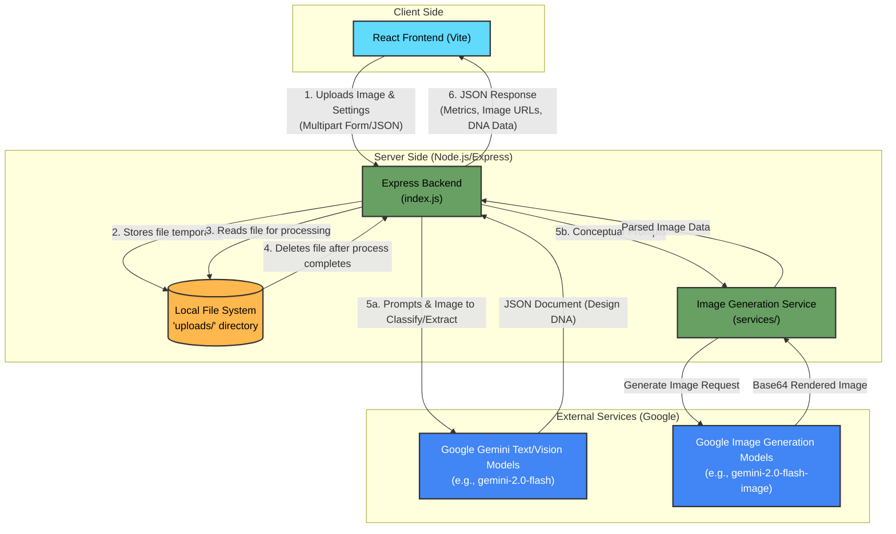

# System Architecture

This document provides a visual representation of how the application components connect with each other, including the frontend, backend, local file system, and Google Gemini API.

### Component Details

- **React Frontend (Vite)**: The user interface where users upload images, configure generation settings (like Fashion, Industrial, Spatial modes), and view the generated designs and cost metrics.
- **Express Backend ([index.js](file:///Users/imadsharieff/Desktop/dna/index.js))**: The orchestrator. It serves the statically built frontend, provides RESTful API endpoints (`/api/extract`, `/api/generate-industrial`, etc.), securely holds the `GEMINI_API_KEY`, manages chunked responses to bypass server timeouts, and routes prompts.
- **Local File System (`uploads/`)**: Handled by Multer, the backend temporarily stores uploaded images before submitting them to Gemini as base64 inline data, and systematically cleans them up to free disk space immediately after processing.
- **Google Gemini Text/Vision Models**: The AI core for analyzing user images. Used specifically in the `/api/extract` flow to classify the image domain (Fashion, Industrial, Spatial) and extract "Design DNA."
- **Google Image Generation Models**: Wrapped by the [services/imageGenerationService.js](file:///Users/imadsharieff/Desktop/dna/services/imageGenerationService.js), this handles text-to-image or image-to-image AI conceptualization and returns generated designs based on the formulated prompts from the Express backend.
